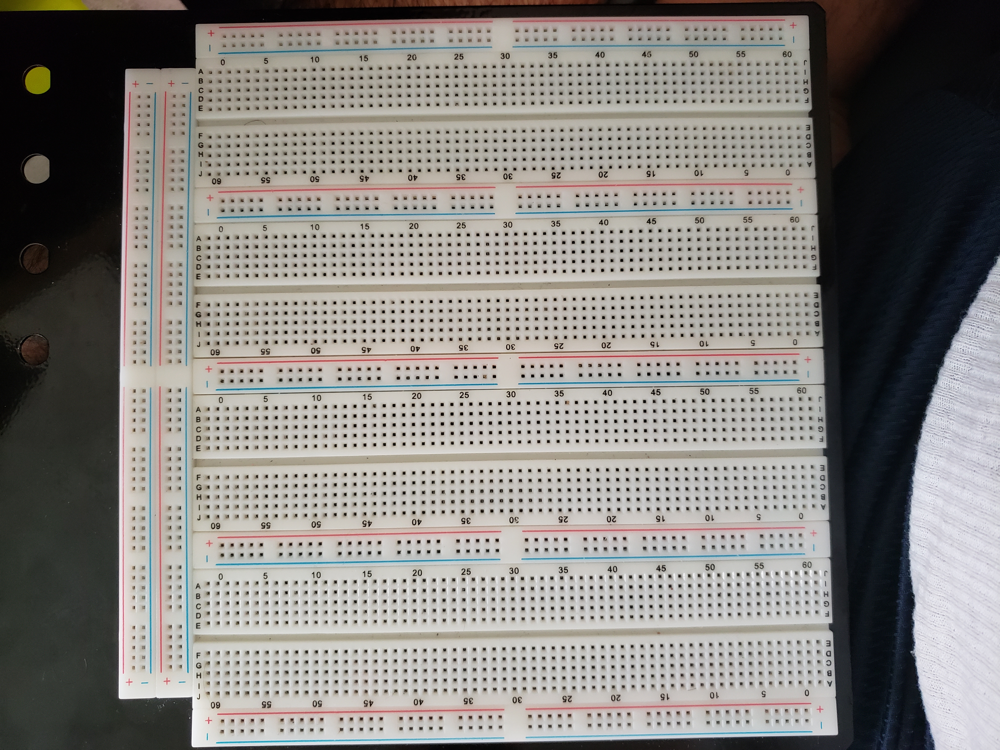
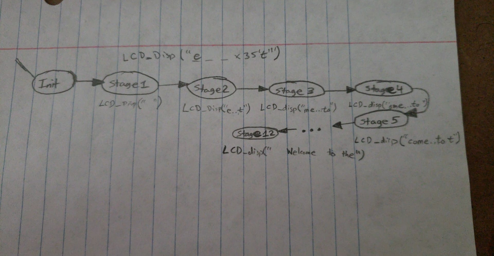
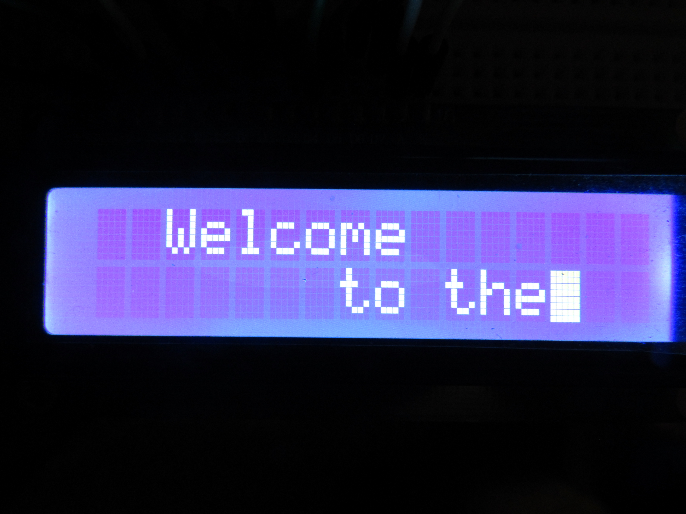
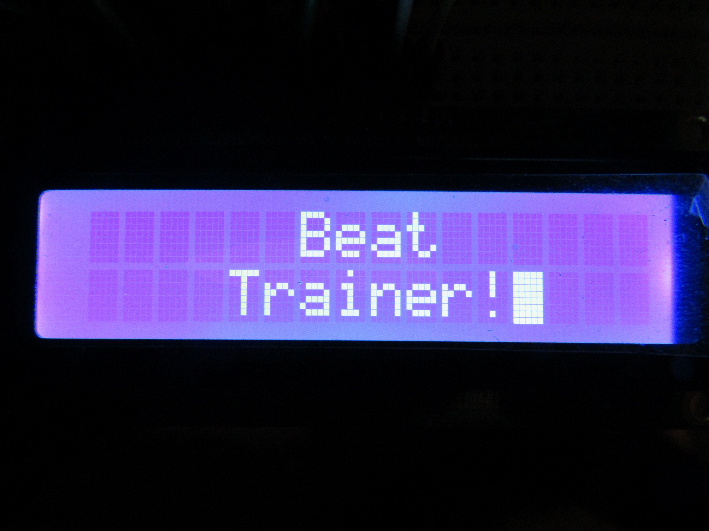

# CS_120B_Final_Project
This will be my CS_120B final project - The Beat Trainer

<h1>Description of Project</h1>

This repository is going to be tracking my changes and additions throughout these next couple of weeks.
The goal this far, is to get familiar with how to use Github and teach myself how to make a project work on here, for possible future projects.

<h2>Here is the official start of my project! This is what a beginning of something looks like. This is a moment in history, not really, in which we get
to see the start of a project versus the completed product that is typically mass produced, sold, and sitting in our households.

   

   

<h2>Beginning of LCD screen</h2>

This is the layout for the beginning messages of my LCD display. This statically gives you a dynamic perspective of what the code will display on the screen.  

After 5 different attempts at creating a working Finite State Machine (FSM), this one seems to be the most promising. This is also the one that I will be pushing my test code for to
test if it works properly. If this test code works as intended, then I shall stick with this one and use it in the final project - as the intro screen before 'START'.   

  

<h3>Test of the intro screen</h3>

Here are a few of the results on screen after running the <em>Beginning_Messages.c</em> file.  This is the scrolling message that the player will see upon powering on the game! 

 

Here is the second message that appears after the first finishes its cycle.  This is the flashing message that states, "Beat Trainer!" 

<strong>If you would like to see the video of the code in action, you can see it <a href="https://youtu.be/miQS9gsfXd8" title="Let's go see it!!!"/>NOW!</strong>

  

<h2>Joystick</h2>

<strong>I conducted a test to get the joystick working in the four main directions: north (up), south (down), east (right) and west (left). 
The video showing some results is found <a href="https://youtu.be/vbepWqkhsp4" title="An early model of the working joystick"/>HERE!</strong>
